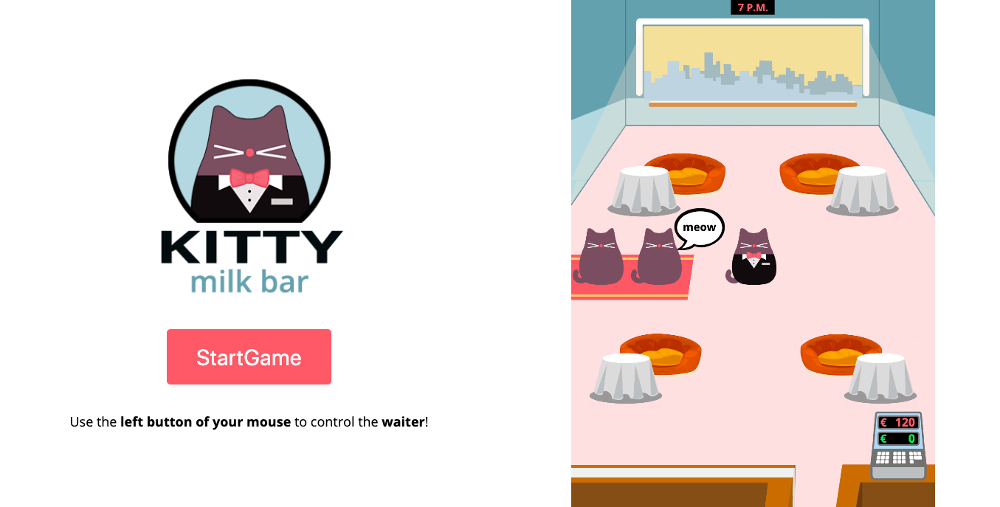

# Kitty milk bar

Kitty milk bar is a **restaurant management game**. Your mission is to help Kitty, the owner of the bar, to **take care of all customers**.

**How to play?** Only one way: use the **left button of your mouse** to click on the interactive elements and show Kitty what to do.

**List of interactive elements:**
* customers
* seats
* tables
* dishes

**How to win?** By earning at least the targeted money objective.

## Want to play?
**Live demo:** [available here](https://pierregambaud.github.io/kitty-milk-bar/)

## Getting Started

These instructions will get you a copy of the project up and running on your local machine for development and testing purposes.

### Prerequisites

Nothing special: a browser and a code editor.

### Launching

Simply open index.html

## Author

* **Pierre Gambaud** - https://github.com/pierregambaud - https://www.linkedin.com/in/pierregambaud/

## Acknowledgments

* Inspired by PinguinDiner game
* A special thanks to IronHack and its greats teachers